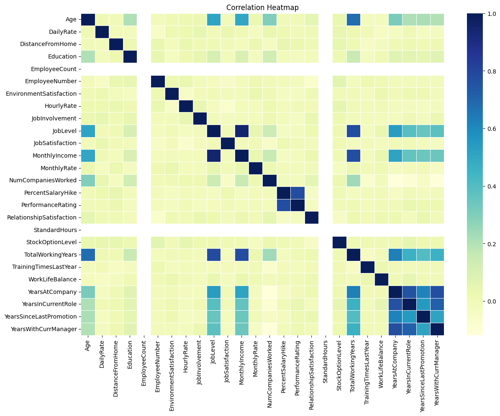
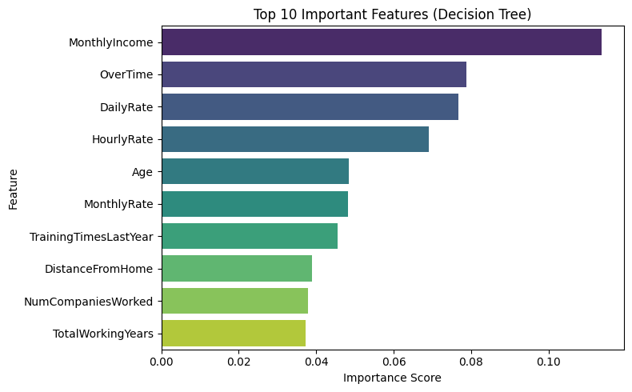

## HR Analytics – Employee Attrition Analysis

This project analyzes the IBM HR Analytics Employee Attrition dataset to understand the main factors influencing employee turnover.  
The focus is on exploratory data analysis (EDA), visual insights, and basic machine learning models for interpretability rather than prediction performance.

---

### About the Project
The goal of this analysis is to explore relationships between employee demographics, satisfaction, and work-related variables to uncover key drivers of attrition.  
The dataset consists of **1470 records** and **35 attributes** such as age, monthly income, job satisfaction, department, and overtime status.

A simple **logistic regression model** and a **decision tree model** were applied to identify which variables most strongly contribute to employee attrition.

---

### Dataset
**Source:** IBM HR Analytics Employee Attrition & Performance dataset (Kaggle)  

**File:**  
`data/WA_Fn-UseC_-HR-Employee-Attrition.csv`

---

### Tools and Libraries
- **Python** (pandas, numpy, matplotlib, seaborn)  
- **scikit-learn** (LabelEncoder, LogisticRegression, DecisionTreeClassifier, StandardScaler)  
- **Jupyter Notebook**

---

### Folder Structure

```bash
HR-analytics/
│
├── data/
│   └── WA_Fn-UseC_-HR-Employee-Attrition.csv
│
├── visualizations/
│   ├── attrition_causes.png
│   ├── correlation_heatmap.png
│   ├── count_attrition.png
│   ├── count_gender.png
│   ├── count_department.png
│   └── feature_importance.png
│
└── hr_analytics.ipynb
```

---

## Process Overview

1. **Data Import and Inspection**
   - Checked data structure, data types, and missing values (none found).  
   - Clean dataset allowed direct exploration.

2. **Exploratory Data Analysis**
   - Visualized gender and department distributions.  
   - Compared age, income, and job satisfaction by attrition status.  
   - Generated a correlation heatmap to identify relationships among numeric features.

3. **Feature Encoding and Scaling**
   - Converted categorical variables to numeric using **LabelEncoder**.  
   - Standardized numeric columns using **StandardScaler** for model stability.

4. **Modeling**
   - **Logistic Regression** for baseline classification.  
   - **Decision Tree** for feature importance interpretation.

---

## Key Visual Insights
 
Shows how numerical variables relate to each other. Strong positive relationships appear between MonthlyIncome, TotalWorkingYears, and YearsAtCompany.

Findings from visual analysis indicated that employees who work overtime, earn lower salaries, and have lower satisfaction scores are more likely to leave.  
Additionally, younger employees and those with fewer years at the company showed higher attrition rates.

---

## 🌳 Feature Importance (Decision Tree)

 
Decision Tree results highlight that MonthlyIncome, OverTime, and DailyRate are the strongest predictors of attrition.

Top factors influencing attrition included:

- Monthly Income  
- OverTime  
- Daily Rate  
- Hourly Rate  
- Age  
- Total Working Years  

These results emphasize the relationship between **compensation**, **workload**, and **retention**.

---

## Results and Conclusion

- The **logistic regression model** achieved around **86% accuracy**, performing well for identifying employees who stay but less effective in detecting those who leave due to class imbalance.  
- **Decision Tree** analysis helped highlight that **salary level, overtime workload, and total work experience** are the strongest predictors of attrition.  
- The analysis suggests that HR teams should prioritize **workload balance** and **fair compensation strategies** to reduce employee turnover.

---

## Author

**Harun Bilge**  
Data Analyst | Python | SQL | Power BI  
📍 Istanbul  

🔗 [harunbilge.com](https://harunbilge.com) • [LinkedIn](https://www.linkedin.com/in/harun-bilge-b65a2a292) • [GitHub](https://github.com/Harun-Bilge)


